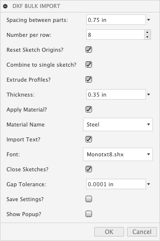

# DXF Importer
A utility for Fusion 360 to import multiple DXF files.

[How to use](#How-to-use)

[How to install](#How-to-install)

[For Developers](#For-Developers)

----

## How to use

Click the *DXF Import* button on the Tools Tab in the Design Workspace.

When you launch the command you will be prompted to select a number of DXF files.

Fusion will import each DXF file. One component is created for each imported file and the utility will spaces the DXF's in a grid.  

The following options can also be set to perform various customizations and cleanup of the imported DXF files.

### Options: 
* *Spacing between parts* - You can set the spacing between the imported files by changing the value.
* *Number per row* - You can also adjust the number of files per row by adjusting the  option.
* *Reset Origins* - This option will move the entities in each sketch (layer of the dxf file) such that the bottom left corner of their bounding box is at the parts origin.
* *Combine to a single sketch* - If checked all layers in the DXF will be combined into a single sketch.  If unchecked a sketch will be created for each layer in the dxf file.
* *Extrude Profiles* - This option with extrude the outer profile of each sketch. 
* *Thickness* - The to the value to extrude profiles (If checked).
* *Keep Sketches Shown* - If checked, and you choose to extrude the profiles, the sketch will remain visible in the scene.
* *Apply Material* - You can choose to automatically assign a material to all the newly created components.
* *Material Name* - The material to apply.  Note the material must exist in the current model.  You can browse the material library and add your chosen material before running the import command.
* *Import Text* - If selected text from the DXF file will be read and rebuilt as Fusion 360 Text.  The units of the DXF file will be used for scaling if they are present.  If not the current document units will be used to interpret size.
* *Font* - The Font to use for the imported text.  To edit the available fonts you can edit the `fonts.txt` file located in: `./commands/resources`
* *Close Sketches* - This option will attempt to close small gaps in the imported file.  
* *Gap Tolerance* - 2 points within this tolerance will be merged.  NOTE:  This will, of course, have very subtle effects on the exact placement of imported geometry.
* *Save Settings* - The current settings in the dialog will be saved as defaults for the next time you use the command.
* *Show Popup* - If this is unchecked AND you save your settings, the popup informing you to select DXF's will not be displayed on future runs.

## How to install
1. [Download the latest distribution](https://github.com/tapnair/DXFImporter/raw/master/build/__LATEST__/DXFImporter.zip)

2. Unzip the archive to a permanent location on your computer

3. It is important that the directory be named *DXFImporter*.  
If you have previously downloaded this or otherwise, make sure the latest version has exactly that directory name.

### Inside Fusion 360  

1. Launch Fusion 360.   
2. On the main toolbar click the **Scripts and Addins** button in the **Addins** Pane

	

3. Select the **Addins tab** and click the "add"  

    ![].(/resources/scripts-addins.png)
    
4. Browse to the 'DXFImporter' directory
*Note: this may be the top level folder depending on the zip utility you use or if it is mac vs. windows.*
    
     
     
     
5. Click run.  
6. Dismiss the Addins dialog.  
7. Click the **Tools** Tool Bar Tab and you should see **DXF Import** Panel and commands.

	

### For Developers
Clone the repo

Update the apper submodule by browsing to the unzipped directory and executing:

    git submodule update --remote
   
## License
Copyright 2020 Patrick Rainsberry

Permission is hereby granted, free of charge, to any person obtaining a copy of this software and associated documentation files (the "Software"), to deal in the Software without restriction, including without limitation the rights to use, copy, modify, merge, publish, distribute, sublicense, and/or sell copies of the Software, and to permit persons to whom the Software is furnished to do so, subject to the following conditions:

The above copyright notice and this permission notice shall be included in all copies or substantial portions of the Software.

THE SOFTWARE IS PROVIDED "AS IS", WITHOUT WARRANTY OF ANY KIND, EXPRESS OR IMPLIED, INCLUDING BUT NOT LIMITED TO THE WARRANTIES OF MERCHANTABILITY, FITNESS FOR A PARTICULAR PURPOSE AND NONINFRINGEMENT. IN NO EVENT SHALL THE AUTHORS OR COPYRIGHT HOLDERS BE LIABLE FOR ANY CLAIM, DAMAGES OR OTHER LIABILITY, WHETHER IN AN ACTION OF CONTRACT, TORT OR OTHERWISE, ARISING FROM, OUT OF OR IN CONNECTION WITH THE SOFTWARE OR THE USE OR OTHER DEALINGS IN THE SOFTWARE.
## Written by

Written by [Patrick Rainsberry](https://twitter.com/prrainsberry)   (Autodesk Fusion 360 Product Manager)

See more useful [Fusion 360 Utilities](https://tapnair.github.io/index.html)

Analytics

